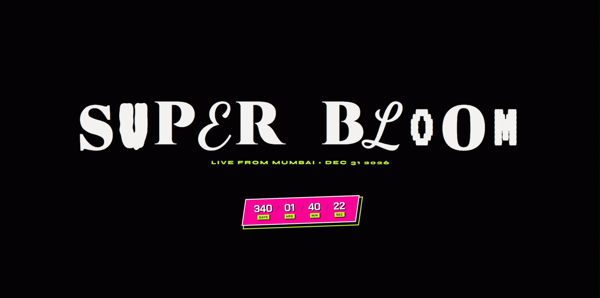

# 🌸 SUPER BLOOM '26

> **"Sweet. Sound. Chaos."**

A high-fidelity, cyber-industrial landing page for **Super Bloom**, a fictional music festival taking over Mumbai in 2026. This project is a "glitch in the simulation" a fully responsive, motion-heavy experience designed to look like a terminal interface from the future.

> **[LIVE DEMO](https://superbloom.vercel.app/)**



## The Vibe

We pivoted from a standard festival page to **"Mumbai Cyber Underground."**
The design language borrows from _Cyberpunk 2077_ and _Far Cry New Dawn_: neon acids, deep blacks, glitch typography, and industrial grids.

## Tech Stack

- **Core:** Semantic HTML5, CSS3 (Variables + Grid), JavaScript (ES6+).
- **Build Tool:** [Vite](https://vitejs.dev/).
- **Motion:** [GSAP](https://gsap.com/) (ScrollTrigger & Tweening).
- **Fonts:** Orbitron, Syne, Chakra Petch (via Google Fonts).

## Key Features

### 1. The "Loki" Hero Section

- **Dynamic Typography:** The main "SUPER BLOOM" title uses a font-randomizing script that cycles through 7 different typefaces in real-time to create a "decryption" effect.
- **Countdown Timer:** A Javascript-driven countdown to NYE 2026 with a 3D-skewed, neon-bordered UI.

### 2. Immersive Artist Lineup

- **Video Headliners:** Replaced static images with optimized, looping MP4 backgrounds for headliners (The Weeknd, Dua Lipa, etc.). Features a `preload="none"` strategy for performance.
- **Infinite Marquee:** The "Underground" lineup (Divine, Hanumankind, Seedhe Maut) scrolls infinitely using a seamless GSAP loop.

### 3. Responsive "Cyber-Grid" Layout

- **Mobile-First:** The site uses a "nuclear" responsive strategy (`overflow-x: hidden`) to handle skewed elements on mobile without breaking the viewport.
- **Adaptive Typography:** Uses `clamp()` functions for fluid font scaling from iPhone SE to 4K desktops.

### 4. The Waitlist Terminal

- **Interactive Form:** A "Command Line" style input field that captures emails for the pre-sale.
- **UX Micro-interactions:** The "Join Waitlist" button simulates a network request and updates the UI state ("Access Granted") upon submission.

## Project Structure

```text
/public
  /videos          # Optimized background loops (Weeknd, Diljit, etc.)
/src
  artists.js       # The "Database" (JSON-like array of artists)
  main.js          # The "Brain" (GSAP logic, Form handling, Timer)
  style.css        # The "Skin" (Neon palette, Grid layouts, Media Queries)
index.html         # The Skeleton
```

## Use the Repo

```
git clone https://github.com/NyxLumen/Super-Bloom.git
cd Super-Bloom
npm install
npm runn dev
```

<p align=center>
Made with Love 🌸
</p>

---
